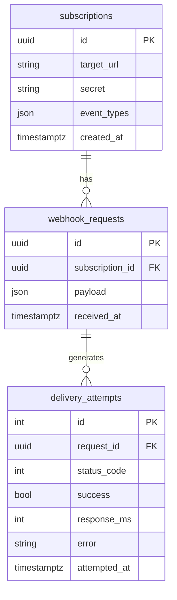

# (Segwise Assignment) Webhook Delivery System

## Deployed Link: https://api-38wr.onrender.com/docs 


## Project Vision
> **Mission:** deliver any event, to any endpoint, with rock‑solid reliability, bullet‑proof security, and developer‑friendly ergonomics.

This service ingests JSON events, queues them for delivery, retries intelligently, and exposes rich observability — all with a single `POST /ingest`.


## 🧱 Tech Stack Overview

| **Component**       | **Pick This**               | **Why / What to Install**                                                                 |
|---------------------|-----------------------------|--------------------------------------------------------------------------------------------|
| **Language**        | Python 3.12                 | Familiar, async‑friendly, massive ecosystem, great for API-heavy backends.                 |
| **Web Framework**   | FastAPI                     | Async-ready, built-in OpenAPI docs, minimal UI, ideal for REST APIs.                       |
| **Task Queue**      | Celery 5 + Redis            | Handles retries & scheduling; works seamlessly with Python; well-documented.               |
| **Database**        | PostgreSQL 16               | Reliable, supports JSONB for flexible event payloads, free on platforms like Render.       |
| **Deployment**      | Render.com (Docker-based)   | Easy CI/CD, managed Redis/Postgres, auto health checks, free tier support.                 |
| **Containerization**| Docker + Docker Compose     | Uniform dev/prod environments; compose orchestrates services like API, worker, DB.         |
| **ORM & Migrations**| SQLAlchemy + Alembic        | Declarative modeling, robust migrations, production-grade tooling.                         |
| **Dev Toolkit**     | Poetry, pre-commit, pytest  | Manages deps, enforces code standards, enables CI workflows with GitHub Actions.           |
| **Bonus Utilities** | `lru_cache`, HMAC signing   | Caching speeds up hot paths; HMAC ensures request authenticity and tamper protection.      |


## Architecture Overview


* **FastAPI** handles ingestion & status queries (stateless).
* **PostgreSQL** stores metadata (payloads in `JSONB`).
* **Celery + Redis** drive asynchronous delivery / retry.
* **Render.com** hosts **one web service** (FastAPI + Celery worker ∕ beat) plus managed Postgres & Redis.

---

## API Reference

| Method | Path                        | Purpose                          |
| ------ | --------------------------- | -------------------------------- |
| GET    | `/health`                   | Liveness probe                   |
| POST   | `/subscriptions`            | Create subscription              |
| GET    | `/subscriptions/{id}`       | Fetch subscription               |
| POST   | `/ingest`                   | Ingest event                     |
| GET    | `/status/request/{id}`      | Attempt log for a request        |
| GET    | `/status/subscription/{id}` | Recent attempts for subscription |

---

## Core Functionality

### 1️⃣ Create a Subscription

```bash
curl -X POST https://your‑host/subscriptions \
     -H "Content-Type: application/json" \
     -d '{
           "target_url": "https://webhook.site/<uuid>",
           "secret": "s3cr3t",
           "event_types": ["invoice.paid", "user.created"]
         }'
```

**Response**

```json
{
  "id": "36b5eeec-3d5d-481c-884f-a5eda8bbe05c",
  "created_at": "2025-05-04T05:44:36.291Z"
}
```

### 2️⃣ Ingest an Event (+ HMAC Signature)

```bash
# tiny helper
sign() { python - <<'PY' "$1" "$2"
import hmac, hashlib, sys
print('sha256=' + hmac.new(sys.argv[1].encode(), sys.argv[2].encode(), hashlib.sha256).hexdigest())
PY
}

SECRET='s3cr3t'
BODY='{"subscription_id":"36b5eeec-3d5d-481c-884f-a5eda8bbe05c","event_type":"invoice.paid","body":{"id":123}}'
SIG=$(sign "$SECRET" "$BODY")

curl -X POST https://your‑host/ingest \
     -H "Content-Type: application/json" \
     -H "X-Webhook-Signature: $SIG" \
     -d "$BODY"
# → 202 Accepted { "request_id": "…" }
```

### 3️⃣ Automatic Delivery & Retry

* Exponential back‑off (`2, 4, 8, 16, 32 min`) up to **5 attempts**.
* `delivery_attempts` table logs every hit (status, latency, error).

### 4️⃣ Status Endpoints

```text
GET /status/request/{request_id}        # full attempt log
GET /status/subscription/{sub_id}?limit=50
```

---

## Bonus Features

| 💡 Feature                  | Implementation                            | Wow‑Factor                         |
| --------------------------- | ----------------------------------------- | ---------------------------------- |
| **HMAC SHA‑256 Signatures** | `app/signing.py` + `/ingest` guard        | Rejects tampered calls with `401`  |
| **Per‑event Filtering**     | `event_types` column + check in `/ingest` | Drops irrelevant events with `204` |
| **In‑process LRU cache**    | `app/cache.py`                            | \~4× faster hot‑path `GET`         |
| **Scheduled cleanup**       | `tasks.purge_old_attempts` (Celery beat)  | DB stays lean automatically        |

---

## Local Development

```bash
git clone https://github.com/you/webhook‑delivery.git
cd webhook‑delivery

# one‑liner stack
docker compose up --build -d

# run migrations once
docker compose exec api poetry run alembic upgrade head

# run tests
poetry run pytest -q
```

---

## Production Deployment (Render)

```text
render.yaml
├─ web      FastAPI + Celery  (Dockerfile)
├─ worker   Alembic migrate   (Dockerfile.migrate)
├─ redis    Managed service   (free plan)
└─ db       Postgres 16       (free plan)
```

* `start_all.sh` boots **Uvicorn + worker + beat** in one tiny container.
* Health‑check: **`GET /health`** (zero‑downtime deploys).


## Data Model



---

